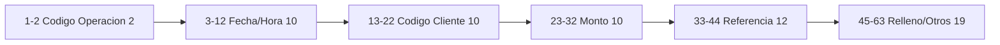
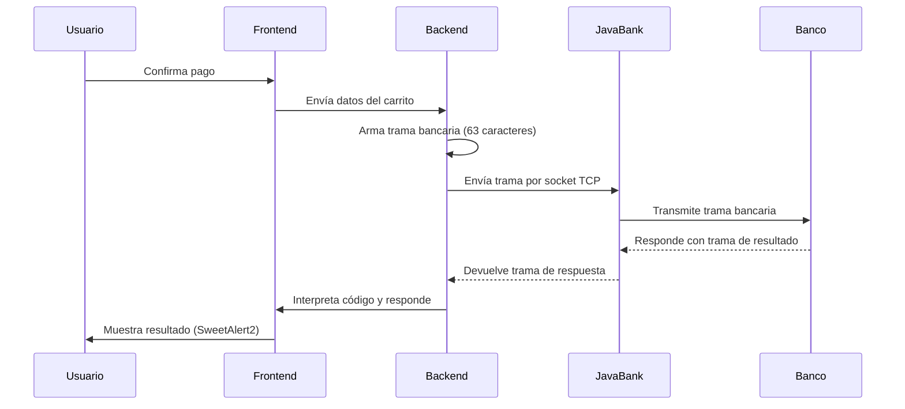
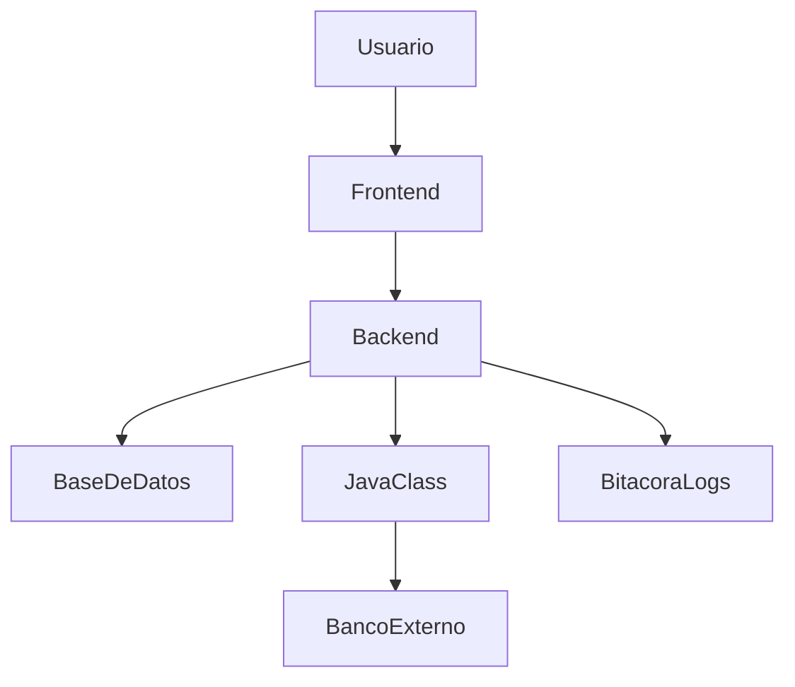

# 🧾 Proyecto Progra

Aplicación web de comercio electrónico desarrollada con Node.js, Express y MySQL, simulando una tienda en línea

---

## 👥 Autores

- **HENRY ANGEL GABRIEL TERET HERNÁNDEZ**   — *1990-23-15274*
- **KATHERINE MICHEL TRUJILLO BARRIENTO**   — *1990-23-14951*
- **DANIELA ALEJANDRA CARRILLO GARCÍA**     — *1990-23-12614*

---

## 🎯 Funcionalidades principales
- 📦 Gestión completa de productos y categorías (alta, baja, cambios y consulta)
- 🖼️ Carga y eliminación de imágenes para los productos
- 🛍️ Carrito de compras dinámico, accesible en cualquier página
- 💳 Simulación de pagos bancarios mediante una trama estructurada
- 📈 Panel administrativo con dashboard para gestión de productos y categorías
- 📁 Logs detallados (bitácora del sistema) para seguimiento de operaciones
- 📡 Comunicación con sistema bancario Java externo vía tramas
- 📱 Interfaz responsiva compatible con dispositivos móviles y escritorio

## 🛠️ Tecnologías utilizadas
- **Backend:** Node.js, Express.js
- **Base de datos:** MySQL
- **Frontend:** HTML5, CSS3 (Flexbox), JavaScript ES6+
- **Notificaciones:** SweetAlert2
- **Carga de archivos:** Multer
- **Logs:** Winston
- **Comunicación bancaria:** Java .class vía Child Process

---

## ⚙️ Instalación

1. **Clona el repositorio:**
   git clone <URL_DEL_REPO>
   cd "Proyecto Progra"

2. **Instala dependencias:**
   npm install

3. **Configura la base de datos y variables de entorno (.env):**

   DB_HOST=localhost
   DB_USER=root
   DB_PASSWORD=
   DB_DATABASE=chatapp
   PORT=3000

4. **Ejecuta el script SQL** para crear las tablas (users, productos, categorias, transacciones, etc.).
5. **Inicia el servidor:**

   npm start
   # o para desarrollo
   npm run dev

6. **Accede a la app:**
   [http://localhost:3000](http://localhost:3000)

---

## 📁 Estructura del proyecto
```bash
Proyecto Progra/
├── public/                # Archivos estáticos (JS, CSS, imágenes)
│   ├── js/
│   ├── styles/
│   ├── img/
│   └── uploads/
│       └── productos/
├── src/                  # Lógica del servidor y controladores
│   ├── controllers/
│   ├── modelo/           # Archivos Java (.java / .class)
│   ├── logs/             # Bitácora del sistema
│   ├── database.js
│   ├── routes.js
│   └── config.js
├── .env
├── .gitignore
├── package.json
└── README.md
```

---

## 🔁 Flujo completo del sistema de pagos bancarios

### 🧩 ¿Qué es una "trama bancaria"?

Una **trama bancaria** es un mensaje estructurado de exactamente 63 caracteres que encapsula toda la información relevante para una transacción bancaria electrónica. Este mensaje es el medio de comunicación entre el sistema de la tienda y el sistema bancario externo (implementado en Java), siguiendo un protocolo estricto y seguro.

#### **Estructura de la trama**
Cada posición de la trama tiene un significado y formato específico. Un ejemplo típico de estructura puede ser:

| Posición | Longitud | Campo                | Descripción                                      |
|----------|----------|----------------------|--------------------------------------------------|
| 1-2      | 2        | Código de operación  | Tipo de transacción (por ejemplo, "01" = pago)   |
| 3-12     | 10       | Fecha/Hora           | AAAAMMDDHH (año, mes, día, hora)                 |
| 13-22    | 10       | Código de cliente    | Identificador único del cliente                  |
| 23-32    | 10       | Monto                | Monto total de la transacción, sin decimales     |
| 33-44    | 12       | Número de referencia | Único para cada transacción                      |
| 45-63    | 19       | Relleno/otros campos | Reservado o para ampliaciones futuras            |

**Ejemplo de trama:**
```
01 2025042301 0000123456 0000015000 202504230001 0000000000000000000
```

#### **Validaciones y armado de la trama**
- **Longitud fija:** La trama siempre debe tener 63 caracteres, usando ceros a la izquierda o espacios para rellenar campos.
- **Campos obligatorios:** El sistema valida que cada campo esté presente y en el formato correcto (por ejemplo, el monto debe ser numérico y positivo).
- **Referencia única:** El backend genera un número de referencia único para cada transacción, evitando duplicados.
- **Integridad:** Antes de enviar, se verifica que la suma de los campos coincida con el total esperado y que no haya manipulación en el frontend.

#### **Comunicación con el sistema bancario**
1. **Generación:** El backend arma la trama y la envía a un proceso Java externo usando sockets TCP/IP.
2. **Transmisión:** El proceso Java conecta con el servidor bancario y transmite la trama.
3. **Recepción:** El servidor bancario responde con otra trama de 63 caracteres, que incluye un código de resultado y, opcionalmente, mensajes adicionales.

#### **Ejemplo de flujo completo**
1. El usuario confirma el pago en la tienda.
2. El backend arma la trama:
   - Código operación: `01` (pago)
   - Fecha/hora: `2025042301`
   - Cliente: `0000123456`
   - Monto: `0000015000` (Q150.00)
   - Referencia: `202504230001`
   - Relleno: `0000000000000000000`
3. Se envía la trama al sistema bancario.
4. El banco responde con:
   - `01...` (aprobada)
   - `02...` (rechazada)
   - `05...` (fondos insuficientes)
   - etc.
5. El backend interpreta la respuesta y:
   - Si es exitosa, registra la transacción, vacía el carrito y muestra un mensaje de éxito al usuario.
   - Si es error, muestra un mensaje claro y permite reintentar.

#### **Códigos de respuesta y manejo en frontend**
- `01`: Éxito (transacción aprobada)
- `02`: Rechazada
- `03`: Sistema fuera de servicio
- `04`: Cancelada por usuario
- `05`: Sin fondos suficientes
- `06`: Cliente no identificado
- `07`: Empresa/Sucursal inválida
- `08`: Monto inválido
- `09`: Transacción duplicada

Cada código es interpretado en el frontend con una alerta visual personalizada (SweetAlert2), colores e iconos distintos, y acciones específicas (volver a intentar, limpiar carrito, etc.).

#### **Seguridad y trazabilidad**
- **No se transmiten datos sensibles** como números de tarjeta reales.
- **Toda la información de la trama y la respuesta** se registra en la base de datos para auditoría y seguimiento.
- **El sistema valida que la trama no sea manipulada** desde el frontend y que el monto corresponda al carrito.
- **Errores y transacciones sospechosas** quedan registradas en la bitácora del sistema.

#### **Ventajas de este esquema**
- Permite simular un entorno bancario real para pruebas y educación.
- Es fácilmente integrable con sistemas bancarios reales que usen protocolos similares.
- La estructura fija y validaciones estrictas minimizan errores y fraudes.

---

## 🗂️ Diagramas del sistema

### Diagrama visual de la estructura de la trama bancaria

Este diagrama representa de forma visual cómo se distribuyen los campos dentro de la trama bancaria de 63 caracteres. Cada bloque muestra el campo, su longitud y propósito, facilitando la comprensión de cómo se arma y valida la trama.





**Explicación:**
- Cada bloque representa un campo de la trama, con su posición y longitud.
- Todos los campos juntos suman exactamente 63 caracteres.
- El relleno final permite futuras ampliaciones o información adicional.

---

### Diagrama de flujo de la trama bancaria

Este diagrama ilustra el flujo completo de la comunicación de la trama bancaria, desde que el usuario confirma el pago hasta la respuesta final del banco y la notificación al usuario. Permite visualizar cómo viaja la información y cómo cada componente interactúa en el proceso.





**Explicación:**
- El usuario inicia el pago desde el frontend.
- El backend arma la trama y la envía mediante un proceso Java.
- El sistema bancario responde y el resultado es mostrado al usuario.
- Todo el proceso es seguro, trazable y validado.

---

### Diagrama de arquitectura general del sistema

Este diagrama muestra la arquitectura general del sistema, resaltando la interacción entre los diferentes componentes: usuario, frontend, backend, base de datos, sistema bancario Java y bitácora de logs. Es útil para entender la infraestructura y los puntos de integración principales.





**Explicación:**
- El usuario interactúa con el frontend en su navegador.
- El backend gestiona la lógica, accede a la base de datos y se comunica con el sistema bancario externo vía Java.
- Los logs y bitácoras permiten auditoría y trazabilidad de todo el sistema.

---

## 🔗 Rutas importantes del sistema

### Sitio principal (Frontend)
| Ruta              | Descripción                        |
|-------------------|------------------------------------|
| `/`               | Página principal                   |
| `/productos`      | Listado de productos               |
| `/carrito`        | Vista del carrito de compras       |
| `/pago`           | Página para finalizar la compra    |
| `/bitacora`/`/logs` | Visualización de eventos del sistema |

### Panel de administración
| Ruta                  | Descripción                      |
|-----------------------|----------------------------------|
| `/admin/login`        | Acceso al panel administrativo   |
| `/admin/dashboard`    | Panel de control                 |
| `/admin/productos`    | Gestión de productos             |
| `/admin/categorias`   | Gestión de categorías            |

---

### Vistas principales (Frontend)
- **Landing:** [http://localhost:3000/](http://localhost:3000/)
- **Productos:** [http://localhost:3000/productos](http://localhost:3000/productos)
- **Carrito:** [http://localhost:3000/carrito](http://localhost:3000/carrito)
- **Pago:** [http://localhost:3000/pago](http://localhost:3000/pago)
- **Bitácora (logs visuales):** [http://localhost:3000/bitacora](http://localhost:3000/bitacora) o [http://localhost:3000/logs](http://localhost:3000/logs)


### Panel administrativo (requiere autenticación)
- **Ingreso a vistas administrativas:**
  - **Login:** [http://localhost:3000/admin/login](http://localhost:3000/admin/login)
  - **Dashboard:** [http://localhost:3000/admin/dashboard](http://localhost:3000/admin/dashboard)
  - **Gestión de productos:** [http://localhost:3000/admin/productos](http://localhost:3000/admin/productos)
  - **Gestión de categorías:** [http://localhost:3000/admin/categorias](http://localhost:3000/admin/categorias)


